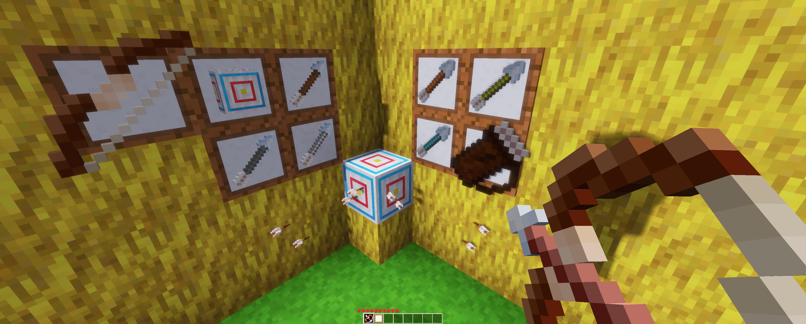

# Bow and Arrows [x_bows]

Adds bow and arrows to Minetest.

Video: https://youtu.be/pItpltmUoa8

## Features

* bow will force you sneak when loaded (optional dep. playerphysics)
* loaded bow will slightly adjust the player FOV
* bow uses minetest tool capabilities - if the bow is not loaded for long enough (time from last puch) the arrow will fly shorter range
* arrow uses raycast
* arrow has chance of critical shots/hits (only on full punch interval)
* arrow uses minetest damage calculation (including 3d_armor) for making damage (no hardcoded values)
* arrows stick to nodes, players and entitites
* arrows remove them self from the world after some time
* arrows remove them self if there are already too many arrows attached to node, player, entity
* arrow continues to fly downwards when attached node is dug
* arrow flies under water for short period of time and then sinks
* arrows adjusts pitch when flying
* arrows can be picked up again after stuck in solid nodes
* registers only one entity reused for all arrows
* (experimental) poison arrow - dealing damage for 5s but will not kill the target
* target block reduces fall damage by -30

## How To

With the bow selected in hotbar and in your hand, press right click on mouse (PC) or the same action as when placing blocks, to load the bow.
For bow to be loaded you have to have arrows in the main invetory. Charging bow will have slight sound effect and can be fired at any time with left click (PC)
or the same action as when you are digging a block. Waiting for full charge of the bow is recommended
as it will give the arrow full speed (maximum shooting distance) and chance for critical arrow (double damage).

There are few indications on how to know when the bow is fully charged:

* there is a distinct "click" sound
* each arrow has "charge time" in the description
* after shooting, arrow will have particle trail

There are few indications on how to know when the arrow is a critical arrow:

* there is a distinct arrow flying sound
* after shooting, arrow will have red particle trail

If you shoot the arrow before the bow is fully charged the speed/distance will be lower and no arrow particle trail will be shown (also no chance for critical arrow).
Changing the selection in hotbar will unload the bow and give you back arrow from the unloaded bow - this applies also when login in to the game (bow will be discharged and arrow will be returned to inventory) and also when you drop the charged arrow (discharged bow will be dropped with arrow item).
If you have `playerphysics` or `player_monoids` mod installed, charged bow will slow you down until you release the arrow.

## Dependencies

- none

## Optional Dependencies

- default (recipes)
- farming (bow and target recipes)
- 3d_armor (calculates damage including the armor)
- hbhunger (changes hudbar when poisoned)
- mesecons (target can be used to trigger mesecon signal)
- playerphysics (force sneak when holding charged bow)

## License:

### Code

GNU Lesser General Public License v2.1 or later (see included LICENSE file)

### Textures

**CC BY-SA 4.0, Pixel Perfection by XSSheep**, https://minecraft.curseforge.com/projects/pixel-perfection-freshly-updated

- x_bows_bow_wood.png
- x_bows_bow_wood_charged.png
- x_bows_arrow_wood.png
- x_bows_arrow_tile_point_top.png
- x_bows_arrow_tile_point_right.png
- x_bows_arrow_tile_point_bottom.png
- x_bows_arrow_tile_point_left.png
- x_bows_arrow_tile_tail.png
- x_bows_arrow_particle.png
- x_bows_arrow_tipped_particle.png
- x_bows_bubble.png
- x_bows_target.png

Modified by SaKeL:

- x_bows_arrow_stone.png
- x_bows_arrow_bronze.png
- x_bows_arrow_steel.png
- x_bows_arrow_mese.png
- x_bows_arrow_diamond.png
- x_bows_arrow_diamond_poison.png

### Sounds

**Creative Commons License, EminYILDIRIM**, https://freesound.org

- x_bows_bow_load.1.ogg
- x_bows_bow_load.2.ogg
- x_bows_bow_load.3.ogg

**Creative Commons License, bay_area_bob**, https://freesound.org

- x_bows_bow_loaded.ogg

**Creative Commons License**, https://freesound.org

- x_bows_bow_shoot_crit.ogg

**Creative Commons License, robinhood76**, https://freesound.org

- x_bows_arrow_hit.1.ogg
- x_bows_arrow_hit.2.ogg
- x_bows_arrow_hit.3.ogg

**Creative Commons License, brendan89**, https://freesound.org

- x_bows_bow_shoot.1.ogg

**Creative Commons License, natty23**, https://freesound.org

- x_bows_arrow_successful_hit.ogg

## Installation

see: http://wiki.minetest.com/wiki/Installing_Mods
